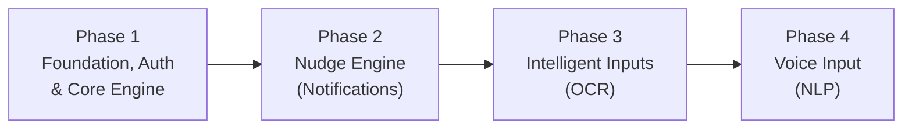

# EvenOut Backend — Full Implementation Plan

## Project Summary

**EvenOut** is a group expense management app for eSewa users in Nepal. This plan covers the **NestJS backend API** deployed on Render, backed by **Supabase** (PostgreSQL + Auth + Storage + Realtime).

The codebase is a fresh NestJS scaffold with `@supabase/supabase-js` already installed. No modules, guards, or migrations exist yet.

---

## Current State

| Area | Status |
|---|---|
| NestJS scaffold | ✅ Bare default (AppModule, AppController, AppService, main.ts) |
| Supabase client | ❌ Not wired up |
| Database tables | ❌ No migrations |
| Auth | ❌ No guard / JWT validation |
| Business logic | ❌ Nothing implemented |
| `.env` | ✅ Has `SUPABASE_URL`, `SUPABASE_KEY`, `SUPABASE_SERVICE_ROLE_KEY` |

---

## Phase Overview



| Phase | Sub-phases | Features Covered |
|---|---|---|
| **Phase 1** — Foundation, Auth & Core Engine | 1A → 1F (6 sub-phases) | DB setup, Auth, Ledger, Groups, Balances, Debt Simplification |
| **Phase 2** — Nudge Engine | 2A → 2B (2 sub-phases) | Context-Aware Notifications, FCM Push |
| **Phase 3** — Intelligent Inputs | 3A → 3B (2 sub-phases) | Receipt Upload, OCR Processing |
| **Phase 4** — Voice Input | 4A → 4B (2 sub-phases) | Speech-to-Text NLP, Expense Auto-fill |

---

## Phase 1: Foundation, Auth & Core Engine

### Sub-Phase 1A — Supabase Database Migrations

> [!IMPORTANT]
> This is the **first deliverable**. No backend code changes — only SQL migration files that define the entire database schema, RLS policies, and the `peer_balances` view.

#### Files

| Action | Path |
|---|---|
| [NEW] | `supabase-migrations/001_create_users.sql` |
| [NEW] | `supabase-migrations/002_create_friendships.sql` |
| [NEW] | `supabase-migrations/003_create_groups.sql` |
| [NEW] | `supabase-migrations/004_create_group_members.sql` |
| [NEW] | `supabase-migrations/005_create_expenses.sql` |
| [NEW] | `supabase-migrations/006_create_expense_splits.sql` |
| [NEW] | `supabase-migrations/007_create_settlements.sql` |
| [NEW] | `supabase-migrations/008_create_receipts.sql` |
| [NEW] | `supabase-migrations/009_create_audit_logs.sql` |
| [NEW] | `supabase-migrations/010_create_notifications.sql` |
| [NEW] | `supabase-migrations/011_create_activity_feed.sql` |
| [NEW] | `supabase-migrations/012_create_peer_balances_view.sql` |
| [NEW] | `supabase-migrations/013_create_rls_policies.sql` |
| [NEW] | `supabase-migrations/014_create_indexes.sql` |

#### What each migration does

1. **`001_create_users`** — `users` table matching ERD (id, phone_number, email, display_name, avatar_url, split_score, timely_settlements, overdue_days_total, fcm_token, is_active, last_seen_at, created_at, updated_at). Links `id` to `auth.users(id)`.
2. **`002_create_friendships`** — `friendships` table with requester/addressee FKs, status enum (`pending`, `accepted`, `declined`, `blocked`), timestamps, unique constraint on the pair.
3. **`003_create_groups`** — `groups` table with created_by FK, invite_code unique, is_archived default false.
4. **`004_create_group_members`** — `group_members` with composite unique on (group_id, user_id), role enum (`admin`, `member`), is_active default true.
5. **`005_create_expenses`** — `expenses` with offline-first fields (client_created_at, synced_at, version, is_deleted). `split_mode` enum (`equal`, `exact`, `percentage`, `chaos_roulette`).
6. **`006_create_expense_splits`** — `expense_splits` with FKs to expenses and users, unique on (expense_id, user_id).
7. **`007_create_settlements`** — `settlements` with payer/payee FKs, status enum (`pending`, `confirmed`, `rejected`), eSewa transaction fields, offline fields.
8. **`008_create_receipts`** — `receipts` linked 1:1 to expenses, OCR fields (raw_ocr_text jsonb, parsed_line_items jsonb, ocr_status enum).
9. **`009_create_audit_logs`** — `audit_logs` for tracking mutations. Immutable (insert-only).
10. **`010_create_notifications`** — `notifications` for the nudge engine with scheduling fields.
11. **`011_create_activity_feed`** — `activity_feed` for group activity timeline.
12. **`012_create_peer_balances_view`** — The `peer_balances` SQL View from the PRD that dynamically calculates net debts.
13. **`013_create_rls_policies`** — Row-Level Security policies for all tables (users can only read/write their own data, group data scoped to membership).
14. **`014_create_indexes`** — Performance indexes on frequently queried columns (FKs, status fields, timestamps).

#### Verification
- All SQL files are syntactically correct and can be run sequentially in Supabase SQL Editor
- Schema matches the ERD exactly

---

### Sub-Phase 1B — NestJS Foundation & Config

> Set up the project structure, environment config, CORS, global pipes, and the Supabase client provider.

#### Files

| Action | Path |
|---|---|
| [MODIFY] | `src/main.ts` — Add global validation pipe, CORS, API prefix |
| [MODIFY] | `src/app.module.ts` — Import ConfigModule, SupabaseModule |
| [NEW] | `src/common/supabase/supabase.module.ts` — Global Supabase module |
| [NEW] | `src/common/supabase/supabase.service.ts` — Injectable service wrapping `@supabase/supabase-js` (admin client via service role key) |
| [NEW] | `src/common/filters/http-exception.filter.ts` — Global error formatting |
| [NEW] | `src/common/dto/pagination.dto.ts` — Reusable pagination DTO |
| [MODIFY] | `.env` — Add `PORT`, `CORS_ORIGIN` |

#### Key Decisions
- API prefix: `/api/v1`
- Supabase service exposes **two clients**: `getClient()` (public/anon key for user-scoped queries) and `getAdminClient()` (service role key for server-side operations)
- Install `class-validator` and `class-transformer` for DTO validation

#### Verification
- `npm run start:dev` boots without errors
- `GET /api/v1/health` returns `{ status: 'ok' }`

---

### Sub-Phase 1C — Auth Guard & User Module

> Protect all routes behind Supabase JWT verification. Create the Users module for profile management.

#### Files

| Action | Path |
|---|---|
| [NEW] | `src/common/guards/supabase-auth.guard.ts` — Extracts Bearer token, verifies via `supabase.auth.getUser(token)`, attaches user to request |
| [NEW] | `src/common/decorators/current-user.decorator.ts` — `@CurrentUser()` param decorator |
| [NEW] | `src/common/decorators/public.decorator.ts` — `@Public()` to skip auth on specific routes |
| [NEW] | `src/users/users.module.ts` |
| [NEW] | `src/users/users.controller.ts` — `GET /users/me`, `PATCH /users/me`, `GET /users/:id/profile` |
| [NEW] | `src/users/users.service.ts` — Profile CRUD, SplitScore retrieval |
| [NEW] | `src/users/dto/update-user.dto.ts` |
| [MODIFY] | `src/app.module.ts` — Register guard globally, import UsersModule |

#### Key Decisions
- Auth guard is **global** (applied to all routes via APP_GUARD). Individual routes can opt out with `@Public()`.
- On first login, a database trigger (or the auth callback) should create the `users` row. The NestJS guard will handle the case where the user exists in `auth.users` but not yet in `public.users` by auto-creating the profile.

#### Verification
- Unauthenticated requests receive `401 Unauthorized`
- Authenticated requests with valid Supabase JWT can hit `GET /api/v1/users/me`

---

### Sub-Phase 1D — Groups & Membership Module

> Full CRUD for groups, joining via invite code, member management.

#### Files

| Action | Path |
|---|---|
| [NEW] | `src/groups/groups.module.ts` |
| [NEW] | `src/groups/groups.controller.ts` — `POST /groups`, `GET /groups`, `GET /groups/:id`, `PATCH /groups/:id`, `DELETE /groups/:id`, `POST /groups/join`, `GET /groups/:id/members`, `DELETE /groups/:id/members/:userId` |
| [NEW] | `src/groups/groups.service.ts` — Group CRUD, invite code generation, member join/leave, role management |
| [NEW] | `src/groups/dto/create-group.dto.ts` |
| [NEW] | `src/groups/dto/update-group.dto.ts` |
| [NEW] | `src/groups/dto/join-group.dto.ts` |
| [MODIFY] | `src/app.module.ts` — Import GroupsModule |

#### Key Decisions
- Invite codes are short random alphanumeric strings (8 chars) — the QR code on Flutter side encodes a deep link containing this code
- Creator automatically becomes `admin` role in `group_members`
- Archiving a group soft-deletes it (`is_archived = true`)

#### Verification
- Full CRUD flow: create group → get invite code → join with another user → list members → remove member
- Authorization: only group admins can update/delete/remove members

---

### Sub-Phase 1E — Expenses, Splits & Settlements Module

> The core Ledger Engine — creating expenses, splitting them, recording settlements.

#### Files

| Action | Path |
|---|---|
| [NEW] | `src/expenses/expenses.module.ts` |
| [NEW] | `src/expenses/expenses.controller.ts` — `POST /expenses`, `GET /expenses`, `GET /expenses/:id`, `PATCH /expenses/:id`, `DELETE /expenses/:id` |
| [NEW] | `src/expenses/expenses.service.ts` — Expense CRUD with split calculation logic |
| [NEW] | `src/expenses/dto/create-expense.dto.ts` — Includes split_mode, splits array, supports offline UUID |
| [NEW] | `src/expenses/dto/update-expense.dto.ts` |
| [NEW] | `src/settlements/settlements.module.ts` |
| [NEW] | `src/settlements/settlements.controller.ts` — `POST /settlements`, `GET /settlements`, `PATCH /settlements/:id` |
| [NEW] | `src/settlements/settlements.service.ts` — Settlement recording, status updates |
| [NEW] | `src/settlements/dto/create-settlement.dto.ts` |
| [NEW] | `src/settlements/dto/update-settlement.dto.ts` |
| [MODIFY] | `src/app.module.ts` — Import ExpensesModule, SettlementsModule |

#### Key Decisions
- Expense creation is an **upsert** (idempotent) to support offline-first sync — the Flutter client sends the UUID, and if it already exists, the version is compared
- Split modes: `equal` (auto-calculate), `exact` (amounts provided), `percentage` (percentages provided), `chaos_roulette` (elimination order provided, 50% cascading reduction applied server-side)
- Soft delete via `is_deleted = true` for expenses (preserves audit trail)

#### Verification
- Create an expense with equal split → verify `expense_splits` rows are created correctly
- Create a settlement → verify `peer_balances` view reflects the change
- Upsert test: send same expense UUID twice → no duplicate, version incremented

---

### Sub-Phase 1F — Balances & Debt Simplification

> The `peer_balances` view query + the Greedy Debt Simplification algorithm endpoint.

#### Files

| Action | Path |
|---|---|
| [NEW] | `src/balances/balances.module.ts` |
| [NEW] | `src/balances/balances.controller.ts` — `GET /groups/:id/balances`, `GET /groups/:id/optimized-settlements` |
| [NEW] | `src/balances/balances.service.ts` — Fetches from `peer_balances` view, runs Greedy Algorithm |
| [MODIFY] | `src/app.module.ts` — Import BalancesModule |

#### Key Decisions
- The Greedy Algorithm is implemented exactly as specified in the PRD (TypeScript code provided in README)
- Balances are **never stored** — always computed from the view
- The endpoint returns optimized settlement suggestions (who should pay whom and how much)

#### Verification
- Create a scenario: A pays 300 for group of 3 → B and C each owe 100 → `GET /groups/:id/balances` shows correct debts
- `GET /groups/:id/optimized-settlements` returns the minimal set of transactions
- B settles 50 → balances update correctly

---

## Phase 2: Nudge Engine (Notifications)

### Sub-Phase 2A — Notification Templates & Cron Jobs

#### Files

| Action | Path |
|---|---|
| [NEW] | `src/notifications/notifications.module.ts` |
| [NEW] | `src/notifications/notifications.service.ts` — Template strings, debt age checks, notification creation |
| [NEW] | `src/notifications/notifications.controller.ts` — `GET /notifications`, `PATCH /notifications/:id/read` |
| [NEW] | `src/notifications/templates/nudge-templates.ts` — Array of localized, quirky Nepali/English strings |
| [NEW] | `src/notifications/dto/` — DTOs |
| [MODIFY] | `src/app.module.ts` — Import NotificationsModule, ScheduleModule |

> [!NOTE]
> Requires installing `@nestjs/schedule` for cron job support.

### Sub-Phase 2B — FCM Push Integration

#### Files

| Action | Path |
|---|---|
| [NEW] | `src/common/fcm/fcm.module.ts` |
| [NEW] | `src/common/fcm/fcm.service.ts` — Firebase Admin SDK integration for sending pushes |
| [MODIFY] | `src/notifications/notifications.service.ts` — Wire FCM sends into the cron job |
| [MODIFY] | `src/users/users.controller.ts` — Add `PATCH /users/me/fcm-token` endpoint |
| [MODIFY] | `.env` — Add Firebase service account config |

#### Verification
- Cron job runs and creates notification records for overdue debts
- FCM push is sent to correct user device tokens
- `GET /notifications` returns user's notification history

---

## Phase 3: Intelligent Inputs (OCR)

### Sub-Phase 3A — Receipt Upload & Storage

#### Files

| Action | Path |
|---|---|
| [NEW] | `src/receipts/receipts.module.ts` |
| [NEW] | `src/receipts/receipts.controller.ts` — `POST /receipts/upload`, `GET /receipts/:id` |
| [NEW] | `src/receipts/receipts.service.ts` — Upload to Supabase Storage, create receipt record |
| [NEW] | `src/receipts/dto/` — DTOs |
| [MODIFY] | `src/app.module.ts` — Import ReceiptsModule |

### Sub-Phase 3B — OCR Processing Pipeline

#### Files

| Action | Path |
|---|---|
| [NEW] | `src/common/ocr/ocr.module.ts` |
| [NEW] | `src/common/ocr/ocr.service.ts` — Calls Anthropic API with receipt image, parses structured JSON line items |
| [MODIFY] | `src/receipts/receipts.service.ts` — Trigger OCR after upload, store results |
| [MODIFY] | `src/receipts/receipts.controller.ts` — Add `POST /receipts/:id/process` endpoint |
| [MODIFY] | `.env` — Add `ANTHROPIC_API_KEY` |

#### Verification
- Upload a receipt image → stored in Supabase Storage
- OCR processes the image → structured line items returned
- Receipt record updated with parsed data

---

## Phase 4: Voice Input (NLP)

### Sub-Phase 4A — Voice Command Parser

#### Files

| Action | Path |
|---|---|
| [NEW] | `src/common/nlp/nlp.module.ts` |
| [NEW] | `src/common/nlp/nlp.service.ts` — Calls Gemini API with strict JSON prompt to extract payer, payee, amount |
| [MODIFY] | `.env` — Add `GEMINI_API_KEY` |

### Sub-Phase 4B — Voice-to-Expense Endpoint

#### Files

| Action | Path |
|---|---|
| [NEW] | `src/voice/voice.module.ts` |
| [NEW] | `src/voice/voice.controller.ts` — `POST /voice/parse-expense` |
| [NEW] | `src/voice/voice.service.ts` — Orchestrates NLP parsing and returns structured expense data |
| [NEW] | `src/voice/dto/voice-input.dto.ts` |
| [MODIFY] | `src/app.module.ts` — Import VoiceModule |

#### Verification
- Send "I paid 500 for Ashutosh for momo" → returns `{ payer: "current_user", payee: "Ashutosh", amount: 500, title: "momo" }`
- Edge cases: missing fields, ambiguous names

---

## Open Questions

> [!IMPORTANT]
> **Supabase Project**: Is the Supabase project already created and connected (the `.env` has credentials)? Should I generate migrations as standalone SQL files to be run manually in the Supabase SQL Editor, or do you have Supabase CLI set up for local migrations?

> [!IMPORTANT]  
> **Friendships Module**: The ERD includes a `friendships` table, but it's not explicitly listed in the PRD features. Should I build a Friendships CRUD module in Phase 1, or defer it?

> [!IMPORTANT]
> **Activity Feed Module**: Similarly, `activity_feed` is in the ERD but not a named feature. Should automatic activity logging be built alongside the core modules (Phase 1E), or deferred?

> [!IMPORTANT]
> **Audit Logs**: Should audit logging be automatic (via database triggers or NestJS interceptors), or manual (explicitly logged in each service)?

---

## Execution Order

We will proceed **sub-phase by sub-phase**, awaiting your approval after each:

```
1A (DB Migrations) → 1B (NestJS Config) → 1C (Auth + Users) → 1D (Groups) → 1E (Expenses + Settlements) → 1F (Balances) → 2A (Notifications) → 2B (FCM) → 3A (Receipt Upload) → 3B (OCR) → 4A (Voice NLP) → 4B (Voice Endpoint)
```

**Ready to start with Sub-Phase 1A (Supabase Database Migrations)?**
